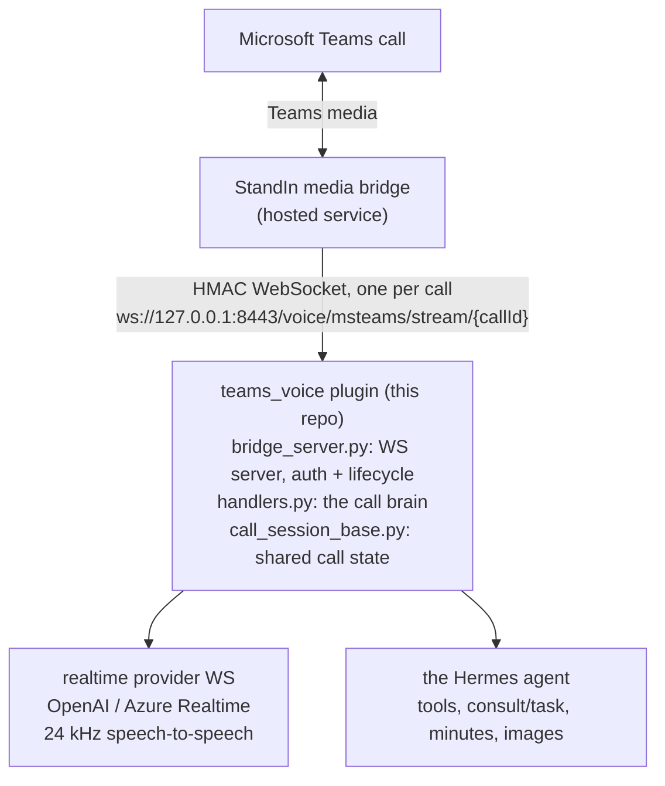
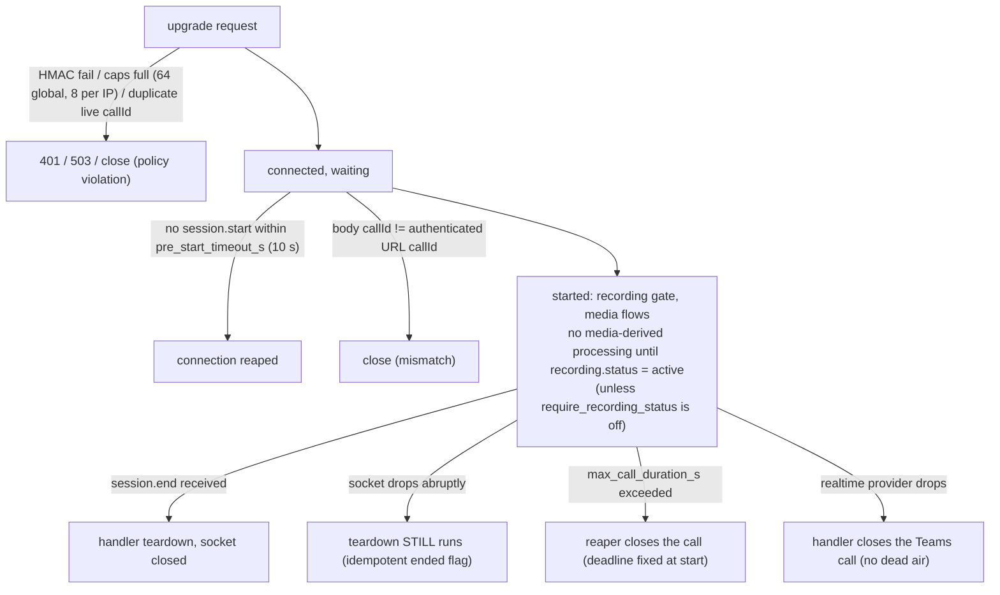
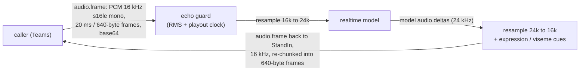

This page is the contributor's mental model of the plugin. Everything here describes
**this repo's** code; the hosted StandIn media bridge appears only through its
externally observable contract (the [Wire Protocol](/hermes-msteams-bridge/wire-protocol/)).

## System overview

The plugin inverts the usual client/server intuition: **it is the server**. It binds
a small WebSocket server on loopback and waits. The StandIn media bridge joins the
Teams call in the cloud and dials in, one WebSocket per call.

A second, much smaller path exists for outbound "call me back": the plugin makes an
HMAC-signed `POST /api/calls` to the StandIn media bridge's loopback HTTP endpoint
(`worker_base_url`, default `http://127.0.0.1:9440`). See
[Outbound Calls](/hermes-msteams-bridge/outbound-calls/).

The server also serves a plain `GET /health` (returns `ok`) for liveness checks.

## Call lifecycle

One connection is one call. The transport layer (`bridge_server.py`) owns every
lifecycle edge so handlers never have to reason about half-open sockets:

Two invariants worth internalizing:

- **Teardown always runs exactly once.** An explicit `session.end` sets the `ended`
  flag; the abrupt-close fallback in the read loop checks it, so realtime sockets and
  ambient tasks never leak, and teardown is never doubled.
- **A handler fault never kills the call.** Every dispatch is wrapped; a bad frame or
  a handler exception is logged and the call continues.

## The handler abstraction

`bridge_server.py` owns transport only. Everything intelligent lives behind
`CallSessionHandler`, a small async interface the server dispatches into:

| Inbound frame | `CallSessionHandler` callback |
|---|---|
| `session.start` | `on_session_start` |
| `audio.frame` | `on_audio_frame` |
| `video.frame` | `on_video_frame` |
| `recording.status` | `on_recording_status` |
| `participants` | `on_participants` |
| `dtmf` | `on_dtmf` |
| `assistant.say` | `on_assistant_say` |
| `session.end` / close | `on_session_end` |
| `ping` | answered by the server itself |

Four implementations ship, selected with `serve --handler`:

| Handler | Role |
|---|---|
| `CallSessionHandler` (`logging`, default) | Logs frames, sends nothing back. The lifecycle smoke test. |
| `EchoCallSessionHandler` (`echo`) | Sends a happy expression on connect and echoes caller audio back. The media-path smoke test. |
| `RealtimeCallSessionHandler` (`realtime`) | The full speech-to-speech brain over the OpenAI/Azure Realtime WS. |
| `StreamingCallSessionHandler` (`streaming`) | Half-duplex STT → agent → TTS with any provider pair. |

Handlers reply through typed `CallSession.send_*` helpers (`send_audio_frame`,
`send_expression`, `send_speech_marks`, `send_display_image`,
`send_assistant_cancel`), which serialize the outbound protocol builders. New
capabilities normally mean a new handler method or tool, not new transport code.

## The realtime audio pipeline

The bridge wire format and the realtime model disagree on sample rate, so the
handler resamples in both directions:

Along the way the handler also runs barge-in (flush playback + `assistant.cancel` +
provider `response.cancel`), the group-call gate, verbal interrupts, and the
per-call vision budget for ambient frames (latest changed frame per source pushed
about every 6 s; a 16-frame keyframe history ring serves `look_at_screen` in
`scope: "history"`).

## Module map

Contributor-level responsibilities (see also
[Contributing](/hermes-msteams-bridge/contributing/)):

| Module | Responsibility |
|---|---|
| `bridge_server.py` | WS server: HMAC handshake, caps, pre-start timeout, max-duration reaper, read/dispatch loop, abrupt-close teardown, `/health`. |
| `protocol.py` | Wire messages: decode with validation, outbound builders. |
| `hmac_auth.py` | Signature computation, constant-time verify, single-use replay guard. |
| `config.py` | `TeamsVoiceConfig` resolution (config.yaml → env → defaults), allowlist policy. |
| `handlers.py` | The call brains: realtime, streaming, echo; recording gate, barge-in, ambient vision. |
| `call_session_base.py` | Shared per-call state + the pending-outbound registry (600 s TTL). |
| `realtime/openai_client.py` | `RealtimeConfig` + the provider WS session (connect, events, response lifecycle). |
| `audio.py`, `streaming_audio.py` | Resampling, frame chunking, RMS. |
| `echo_guard.py`, `group_call_gate.py`, `verbal_interrupts.py` | The gates: self-echo suppression, speak-when-addressed, deterministic stop phrases. |
| `vision_store.py`, `vision_budget.py` | Latest-frame + keyframe history per source; per-call spend cap. |
| `expression.py`, `viseme_estimate.py` | Avatar cues: emotion classification, viseme timelines. |
| `realtime_tools.py`, `call_tools.py`, `agent_consult.py` | The model-facing tools and their dispatch into Hermes. |
| `meeting.py`, `meeting_docx.py` | Minutes/recap and the SharePoint `.docx` upload. |
| `outbound.py` | HMAC-signed place-call with the loopback SSRF guard. |
| `cli.py`, `__init__.py`, `tools.py` | `hermes teams-voice serve|status`, plugin registration, the `teams_voice_status` tool. |

## Trust and security model

The plugin assumes a hostile network and an untrusted caller population; every
boundary has an explicit guard:

| Boundary | Guard |
|---|---|
| Who may connect | The HMAC handshake: only a peer holding the shared secret produces a valid signature. Verified constant-time; missing/invalid → `401`. |
| Replay | The ±60 s timestamp window plus a **single-use** `(callId, ts, signature)` guard; entries expire at the timestamp's own horizon, so future-dated handshakes gain nothing. Only verified tuples are recorded, so unauthenticated traffic cannot grow the map. |
| Who may call the agent | The allowlist is **deny-by-default** by AAD object id. `allow_all` is an explicit opt-in; display-name matching (`allowlist_allow_names`) is off by default because names are spoofable. |
| Secret exposure | The server binds **loopback by default**; a non-loopback bind is warned about. Outbound place-call refuses a non-loopback `worker_base_url` unless `allow_remote_worker` is set, because the request carries the signed secret. |
| Resource exhaustion | Connection caps (64 global, 8 per IP), a 2 MB frame cap, the 10 s pre-start timeout, and the optional `max_call_duration_s` reaper. |
| Compliance | The recording gate: no media-derived processing until Teams recording is `active` (default on). |
| Data retention | The pending-outbound registry expires entries after 600 s; vision keeps only a bounded per-call ring. |

The one rule that spans all of it: this repo documents and depends on the **wire
contract only**. The StandIn media bridge is a black box that authenticates with the
shared secret and speaks the protocol on this site; nothing in this codebase should
assume anything else about it.
