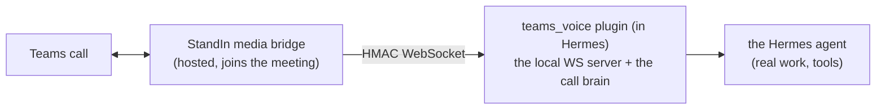

Welcome! **`hermes-msteams-bridge`** (PyPI: `hermes-msteams-bridge`, import
package `hermes_teams_voice`, Hermes plugin name `teams_voice`) adds **Microsoft
Teams voice and video** to a [Hermes](https://hermes-agent.nousresearch.com/docs)
AI agent.

It is a pure-Python Hermes plugin. You install it into the same environment as
Hermes, enable it, and run a small local WebSocket server. The hosted **StandIn
media bridge** joins your Teams call and dials into that server - so your Hermes
agent can talk, see, and act on a real Teams call without you having to build any
Teams media stack yourself.

## What it does

- **Real-time voice** - the caller talks to your agent and hears it reply, with
  natural **barge-in** (interrupt mid-sentence). Two engines:
  - **Realtime** - OpenAI or Azure OpenAI speech-to-speech (lowest latency).
  - **Streaming** - STT → agent → TTS, works with any STT/TTS provider (`ffmpeg`).
- **Vision** - the agent can look at the caller's **shared screen or camera**, both
  on request (`look_at_screen`) and ambiently (it stays visually aware during the
  call), with a per-call spend budget.
- **Avatar cues** - expression (neutral/happy/sad/surprised/thinking), viseme
  lip-sync, and `show_to_caller` to render an image on the bot's tile.
- **Meetings** - "speak only when addressed" group etiquette, per-speaker minutes,
  and an optional end-of-call recap posted to the Teams chat (with an optional
  `.docx` to SharePoint).
- **Tools** - the agent can consult/delegate work, run background tasks, look at the
  screen, show images, **call you back**, and post meeting minutes.
- **DTMF / IVR**, **bilingual EN/AR**, **DoS guards**, and a **cutoff goodbye** when
  a StandIn time limit is reached.

## How the pieces fit

The plugin is the **local WebSocket server** (binds `127.0.0.1:8443`). StandIn is
the **client** that dials in over an HMAC-authenticated WebSocket using a shared
secret both sides hold. You never operate any Teams media yourself - that is
StandIn's job.

Use the sidebar to navigate. Start with **Getting Started**, or jump to the **Configuration Reference** or **Wire Protocol**.

> Full hosted-service docs: [docs.komaa.com](https://docs.komaa.com) · StandIn
> account & dashboard: [standin.komaa.com](https://standin.komaa.com).
